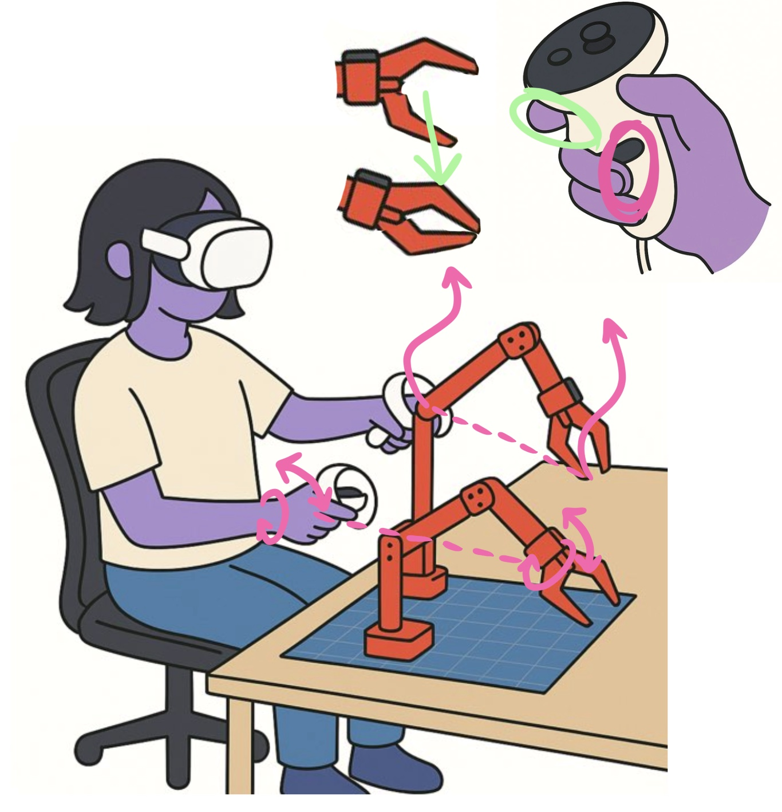

# VR-teleop

VR / keyboard teleoperation for robot manipulators, built around **telegrip** — an
open-source control system that streams Meta Quest (WebXR) controller motion, or
keyboard input, into a live robot arm with shared inverse kinematics, a browser/VR
UI, and optional 3D visualization.

It supports **two robot families** out of the box, selectable from a single config file:

| `robot.type` | Arm | Motors / Bus | DOF | Kinematics |
|--------------|-----|--------------|-----|------------|
| `so100` | [SO-ARM100 / SO-101](https://github.com/TheRobotStudio/SO-ARM100) (and compatible) | Feetech STS3215 servos over USB serial | 6 (5 + gripper) | PyBullet IK/FK |
| `rebot` | reBot **B601-DM** | Damiao motors over CAN (USB bridge or SocketCAN) | 7 (6 + gripper) | Official reBot Pinocchio IK (vendored) |

> **SO-101 note:** the SO-101 is the hardware successor of the SO-ARM100 and uses the
> same Feetech servo platform, so it runs under `robot.type: so100`. Use the SO-101's
> own calibration when prompted.



---

## Features

- **Two robot backends**, one codebase — switch between SO-100/101 and reBot via `config.yaml`.
- **Multiple inputs**: VR controllers (Quest / any WebXR headset, no app install) and keyboard.
- **Shared IK/FK**: PyBullet IK for SO-100/101; the official 6-DOF reBot Pinocchio IK (vendored under `telegrip/telegrip/vendor/rebot_kinematics`) for reBot.
- **reBot motion shaping**: jerk-limited online trajectory generation (Ruckig), One-Euro filtering, per-joint velocity caps, and optional MIT impedance control.
- **Browser + VR web UI** served over HTTPS (self-signed certs auto-generated).
- **Safety**: joint-limit clamping, graceful shutdown, torque disable on exit.
- **Async, non-blocking** architecture; components can be individually disabled for testing.

## Repository layout

```
VR-teleop/
├── README.md            ← you are here
└── telegrip/            ← the application (run commands from this directory)
    ├── config.yaml      ← main configuration (robot type, ports, tuning)
    ├── telegrip/        ← Python package (control loop, drivers, inputs, IK)
    ├── URDF/            ← robot models (SO100, reBot B601-DM / DevArm)
    ├── web-ui/          ← browser + VR WebXR front-end
    └── tests/
```

> All run commands below assume you are **inside the `telegrip/` directory**, because
> the app reads `config.yaml`, `URDF/`, and the SSL certs using paths relative to the
> current working directory.

---

## Requirements

**Hardware**
- An SO-ARM100/SO-101 arm (Feetech) **or** a reBot B601-DM (Damiao CAN), one or two arms.
- USB connection to the arm(s): a USB-serial adapter for SO-100/101, or the Damiao USB-CAN bridge for reBot.
- *(Optional)* a Meta Quest or other WebXR-capable headset on the **same network** as the host.

**Software**
- Python ≥ 3.9
- `openssl` (only if you want to generate SSL certs manually; otherwise auto-generated)

## Installation

```bash
# 1. Clone
git clone https://github.com/Neil7281/VR-teleop.git
cd VR-teleop/telegrip

# 2. (Recommended) create a virtual environment
python -m venv .venv
source .venv/bin/activate        # Windows: .venv\Scripts\activate

# 3. Install the package + the extras for your robot
pip install -e .                 # core (SO-100/101 via Feetech)
pip install -e ".[pybullet]"     # + PyBullet IK / 3D visualization
pip install -e ".[rebot]"        # + reBot support (python-can, pinocchio)
pip install -e ".[dev]"          # + test / lint tooling
```

You can combine extras, e.g. `pip install -e ".[pybullet,rebot,dev]"`.

> SSL certificates (`cert.pem`, `key.pem`) are created automatically on first run and
> are git-ignored. To make them by hand:
> ```bash
> openssl req -x509 -newkey rsa:2048 -keyout key.pem -out cert.pem -sha256 \
>   -days 365 -nodes -subj "/C=US/ST=Test/L=Test/O=Test/OU=Test/CN=localhost"
> ```

---

## Quick start

### 1. Choose your robot in `telegrip/config.yaml`

```yaml
robot:
  type: so100          # "so100" for SO-ARM100/SO-101, or "rebot" for reBot B601-DM
```

### 2. Configure the arm(s) and ports

**SO-100 / SO-101** (Feetech serial):
```yaml
paths:
  urdf_path: URDF/SO100/so100.urdf
robot:
  type: so100
  right_arm: { enabled: true,  name: Right Arm, port: /dev/ttyUSB0 }
  left_arm:  { enabled: false, name: Left Arm,  port: /dev/ttyUSB1 }
```

**reBot B601-DM** (Damiao CAN):
```yaml
paths:
  urdf_path: URDF/reBot_B601_DM/rebot_b601_dm.urdf
robot:
  type: rebot
  right_arm:
    enabled: true
    name: Right Arm
    port: /dev/ttyACM0
    can_adapter: damiao      # "damiao" USB bridge, or "socketcan" for can0/can1…
    dm_serial_baud: 921600
```

### 3. (SO-100/101 only) Calibrate

The first time, calibrate each enabled arm. Torque is disabled so you can move the
arm by hand through homing and joint-range steps:

```bash
telegrip-calibrate            # or: telegrip --calibrate both
```

Calibration is saved per arm and reused on subsequent runs.

### 4. Run

```bash
telegrip                      # from inside the telegrip/ directory
# equivalently: python -m telegrip
```

You'll see something like:

```
🤖 telegrip starting...
Open the UI in your browser on:
https://192.168.x.x:8443
Then go to the same address on your VR headset browser
```

### 5. Control it

- Open the printed `https://<host-ip>:8443` URL in a browser (accept the self-signed cert).
- For VR, open the **same URL** on your headset's browser to launch the WebXR app.
- When the arm indicators are green, click **Connect Robot** and start teleoperating.
- Use `--autoconnect` to skip the manual connect step.

---

## Controls

### VR controllers
- **Hold grip** → the gripper tip tracks your controller position in 3D.
- **Controller roll/pitch** → wrist orientation (reBot can use full orientation; see `rebot_orientation_enabled`).
- **Hold trigger** → close gripper; release → open.
- Left and right controllers drive the left/right arms independently.

### Keyboard
| Action | Left arm | Right arm |
|--------|----------|-----------|
| Forward / Back | `W` / `S` | `I` / `K` |
| Left / Right | `A` / `D` | `J` / `L` |
| Down / Up | `Q` / `E` | `U` / `O` |
| Wrist roll | `Z` / `X` | `N` / `M` |
| Toggle gripper | `F` | `;` |

---

## Command-line options

```
telegrip [OPTIONS]

  --config PATH        Config file (default: config.yaml in the current directory)
  --no-robot           Run without hardware (visualization only)
  --no-sim             Disable PyBullet sim and IK
  --no-viz             Disable the PyBullet GUI (headless)
  --force-sim          Keep PyBullet sim/GUI on for reBot (off by default)
  --no-vr              Disable the VR WebSocket server
  --no-keyboard        Disable keyboard input
  --no-https           Disable the HTTPS server
  --autoconnect        Connect to motors automatically on startup
  --calibrate {left,right,both}   Run calibration then exit
  --log-level LEVEL    debug | info | warning | error | critical (default: warning)
  --https-port PORT    HTTPS UI port (default: 8443)
  --ws-port PORT       WebSocket port (default: 8442)
  --host HOST          Bind address (default: 0.0.0.0)
  --urdf PATH          Override the URDF path
  --left-port PORT     Override left arm serial port
  --right-port PORT    Override right arm serial port
  --cert PATH / --key PATH   Override SSL cert / key paths
```

## reBot tuning

reBot motion quality is shaped entirely from `config.yaml` under `robot:` — no code
changes needed, just restart teleop. The most useful knobs:

- `rebot_motor_velocity_deg_s`, `rebot_joint_max_vel_deg_s` — speed / per-joint caps.
- `rebot_pos_filter_alpha`, `rebot_orient_filter_alpha`, `rebot_oneeuro_*` — smoothing.
- `rebot_max_lin_vel_m_s`, `rebot_max_ang_vel_deg_s` — Cartesian path-following speed.
- `rebot_otg_max_accel_deg_s2`, `rebot_otg_max_jerk_deg_s3` — jerk-limited smoothing.
- `rebot_orientation_enabled`, `rebot_orientation_scale` — wrist/orientation behavior.
- `rebot_control_mode` — `pos_vel` (safe default) or `mit` (impedance: `rebot_mit_kp`,
  `rebot_mit_kd`, `rebot_gravity_ff`). Verify gravity-float before raising MIT gains.

See the inline comments in `config.yaml` for the full annotated list.

---

## Troubleshooting

- **Robot connection failed** — check the serial/CAN port in `config.yaml`; fix
  permissions (`sudo chmod 666 /dev/ttyUSB*` or `/dev/ttyACM*`); test with `--no-robot`.
- **reBot import errors** — install reBot extras: `pip install -e ".[rebot]"` (needs
  `python-can` and `pin`/pinocchio).
- **VR controllers won't connect** — headset and host must be on the same network;
  accept the self-signed cert in the browser first; confirm `cert.pem`/`key.pem` exist.
- **PyBullet issues** — install with `pip install -e ".[pybullet]"`, or run headless
  with `--no-viz` / disable sim with `--no-sim`.
- **Keyboard not responding** — the terminal needs focus; some systems need elevated
  input permissions.
- **Verbose logs** — `telegrip --log-level info` (or `debug`).

## License

MIT — see [telegrip/LICENSE](telegrip/LICENSE). The vendored reBot kinematics retain
their original license; see `telegrip/telegrip/vendor/rebot_kinematics/NOTICE.md`.
